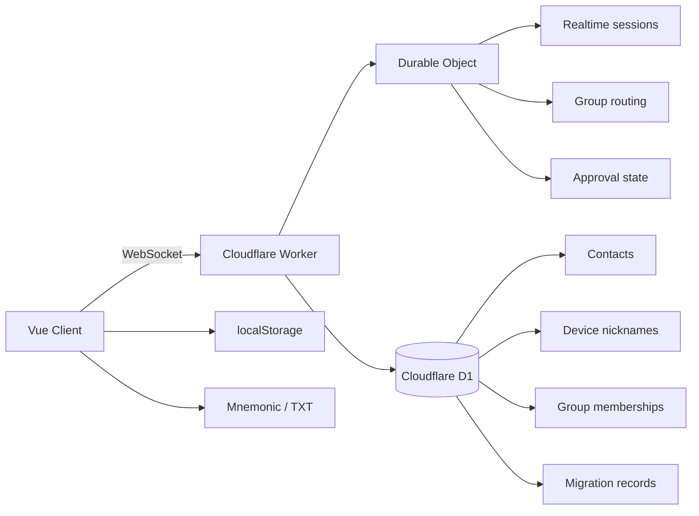

# LINKCONNECT


LINKCONNECT is a privacy-oriented chat system built around device-bound identity rather than phone numbers, email addresses, or password accounts. The client handles message encryption and recovery credentials, while Cloudflare Workers, Durable Objects, and D1 provide realtime coordination, membership state, and persistence.

Product concept, interaction model, and architecture are original to this project. Implementation was completed with Codex assistance.

## Key Capabilities

- Device-bound identity with mnemonic or TXT credential recovery
- Direct messaging, group chat, invite links, and contact management
- Client-side encrypted message flow with delivery, read, retry, and outbox states
- Group event notices rendered inside the group timeline instead of a separate system inbox
- Owner approval for joins initiated through member-generated invite links
- Reconnect recovery for regular group membership, group metadata, and pending approval results
- Mobile-first navigation structured as `Messages / Contacts / Settings`

## Design Principles

- Identity is attached to the device, not to a public account namespace.
- Final device fingerprinting is derived on the server from stable credential material rather than IP or raw browser claims.
- Group operations belong to the group timeline.
- Invite generation and join approval are intentionally separated.
- Reconnect handling prefers strict state restoration over weakened validation.

## Architecture



## Repository

```text
.
├─ src/                     # Vue frontend
├─ backend/
│  ├─ src/index.js         # Worker + Durable Object entry
│  ├─ d1/schema.sql        # D1 bootstrap schema
│  └─ wrangler.toml        # backend deployment config
├─ docs/
│  └─ FAQ.md
├─ wrangler.toml           # Pages config
└─ package.json
```

## Development

Install dependencies:

```bash
npm install
```

Start the frontend:

```bash
npm run dev
```

Optional integrated preview through Cloudflare Pages:

```bash
npm run f:dev
```

Build before committing frontend changes:

```bash
npm run build
```

Validate backend syntax after protocol or state-machine changes:

```bash
node --check backend/src/index.js
```

## Deployment

Frontend:

```bash
npm run build
npm run deploy
```

Backend:

```bash
npx wrangler deploy --config backend/wrangler.toml
```

Initialize D1:

```bash
npx wrangler d1 create telechat-db
npx wrangler d1 execute telechat-db --file=backend/d1/schema.sql --remote
```

Required backend secret:

```bash
npx wrangler secret put INVITE_SIGNING_SECRET --config backend/wrangler.toml
```

Optional frontend environment variable:

- `VITE_WS_URL`: override the default WebSocket endpoint

## Security Notes

- Message bodies are encrypted client-side before transport.
- The server still observes metadata required for routing and membership management.
- Browser-reported device attributes are not treated as authoritative identity.
- This project is privacy-oriented, not metadata-free.

## Docs

- FAQ: [`docs/FAQ.md`](./docs/FAQ.md)

## Current Limitations

- Full cloud-side message history is intentionally not provided.
- Pending join requests are still primarily in Durable Object memory; approval results already support offline replay.
- Group ownership transfer and owner exit are not implemented yet.
- Browser environments cannot provide strong anti-spoof guarantees on their own.
