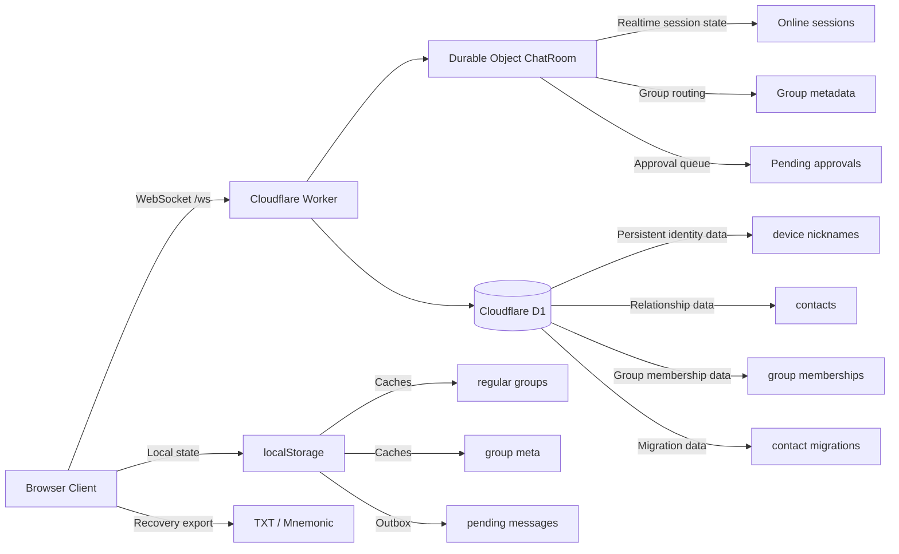

# LINKCONNECT


LINKCONNECT 是一个以“设备即身份”为核心的临时隐私聊天项目。

它不依赖手机号、邮箱或传统账号密码体系，而是通过设备凭证绑定身份，在浏览器中完成消息加密、会话管理、联系人关系和群聊协作。项目面向的是“强隐私、低留存、轻身份”的即时沟通场景，而不是传统的云端消息归档型 IM。

## Overview

- 前端：Vue 3 + Vite + TailwindCSS
- 后端：Cloudflare Workers + Durable Objects
- 数据：Cloudflare D1
- 通信：WebSocket
- 身份：设备密钥 + 恢复凭证（助记词 / TXT）

## Highlights

- 设备绑定身份，不依赖手机号/邮箱/密码
- 默认端到端加密，消息在客户端加密后发送
- 支持私聊、群聊、邀请链接、群成员管理
- 支持联系人体系、联系人迁移、昵称迁移
- 支持中英文助记词恢复身份
- 支持离线发件箱、自动重发、失败重试
- 支持语音消息、阅后即焚、已读回执
- 支持移动端三栏式主导航：消息 / 通讯录 / 设置
- 支持群通知回流到群消息本身，而不是统一塞进系统通知

## Product Positioning

这个项目适合：

- 临时协作沟通
- 对身份暴露敏感的聊天场景
- 不希望长期保留云端聊天记录的场景
- 以“当前设备”为主要身份载体的轻量通信

这个项目不适合：

- 需要完整云端历史消息归档
- 需要企业级审计、留痕、合规归档
- 需要成熟的多端历史同步和消息漫游
- 需要复杂组织架构、权限体系、后台管理面板

## 为什么这样设计

### 为什么不用手机号、邮箱和传统账号体系

- 这个项目的核心目标不是“全平台账户体系”，而是“当前设备即可形成可恢复身份”
- 这样可以减少身份暴露面，也避免把账号体系、验证码、密码找回引入到产品第一阶段
- 身份恢复改由助记词和 TXT 凭证承担，符合轻身份、强隐私的产品方向

### 为什么设备指纹要由服务端计算

- 浏览器上报的设备信息天然可伪造，前端自己生成最终指纹没有可信度
- 因此前端只提供必要材料，服务端再基于 `deviceSecret` 派生稳定指纹
- 指纹计算不绑定 IP、VPN 或临时网络环境，避免正常网络切换导致误判

### 为什么群通知必须进入群消息本身

- 群更名、拉人、踢人、邀请、审批，本质上都属于该群上下文
- 如果这些通知进入系统消息，用户需要在两个会话之间来回切换，交互上是割裂的
- 把群操作通知回流到群消息流，才能让“群状态变化”和“群沟通内容”处于同一时间线

### 为什么非群主生成链接不预审批，而在入群时审批

- 预审批会把“分享链接”这种轻操作做得过重，也会浪费群主注意力
- 真正需要决策的是“谁要加入”，而不是“谁生成了链接”
- 所以当前设计允许成员生成邀请链接，但通过成员链接尝试入群时再由群主确认

### 为什么要做离线补偿，而不是放宽校验

- 群审批、消息发送、成员恢复都不应该因为一端暂时离线就直接降级为弱校验
- 更安全的做法是保留严格状态机，把结果持久化，待对方重连后再补发和恢复
- 这保证了体验可恢复，同时不牺牲服务端的一致性约束

## Core Features

### Identity

- 首次绑定设备后生成身份凭证
- 凭证支持导出为 `.txt`
- 支持中文助记词和英文助记词
- 助记词用于恢复身份，不是装饰性展示文本
- 服务端根据 `deviceSecret` 计算最终指纹，不依赖 IP/VPN

### Messaging

- 文本消息
- 图片消息
- 语音消息
- 已读回执
- 离线发件箱
- 发送中 / 失败 / 已送达 / 已读 状态
- 失败消息支持点击重发

### Burn After Read

- 文本和图片支持阅后即焚
- 语音阅后即焚做了单独优化
  - 进入聊天页不会立刻开始销毁
  - 至少要等语音自然播放完成后才开始焚毁倒计时

### Contacts

- 联系人申请 / 同意 / 拒绝
- 联系人单向移除
- 联系人在线状态同步
- 私聊限制策略基于联系人关系

### Group Chat

- 创建群聊
- 群重命名
- 查看群成员
- 群主移除成员
- 普通成员主动退群
- 群邀请链接
- 群通知直接进入对应群会话

当前群通知包括但不限于：

- 群创建
- 群改名
- 成员加入
- 成员退出
- 成员被移出
- 成员生成邀请链接
- 非群主邀请链接触发的入群审批

### Invite Approval Flow

当前群邀请逻辑是：

- 群主生成邀请链接：直接可用
- 非群主生成邀请链接：也可以直接生成
- 但如果有人通过“非群主生成的链接”尝试入群，则需要群主审批
- 生成链接的人和申请入群的人都可以附带一段说明
- 审批消息显示在群里，不走系统通知
- 如果群主审批时申请人离线，审批结果会持久化，申请人重连后自动领取

## Key Interaction Rules

### Device Identity

- 用户身份绑定在设备上
- 同一设备指纹只允许一个在线会话
- 新会话重新绑定后会踢掉旧连接

### Direct Message Restriction

- 如果你不在对方通讯录中，对方回复前你只能先发一条
- 对方回复后，该设备对的私聊限制会解除
- 如果你已经在对方通讯录中，则不受这一限制

### Group Membership Recovery

- 普通群成员关系会持久化
- 重连后会自动恢复已加入群
- 自己创建的群也会随身份恢复
- 群名会本地持久化，避免重连后退化为 `grp-*`

## Security Model

### What Is Protected

- 聊天正文在客户端加密后再发送
- 私聊消息使用设备间的密钥协商
- 身份恢复依赖本地凭证和助记词/TXT

### What The Server Still Knows

服务端仍然可见：

- 在线状态
- 群成员关系
- 时间戳
- 消息路由元数据
- 设备层网络信息

也就是说，这不是“零元数据系统”，而是“正文尽量端到端保护，元数据最小必要保留”的模型。

### Threat Model Notes

- 浏览器环境中的“设备信息”本身可以被伪造
- 因此最终设备指纹不直接信任前端上报的指纹值，而是由服务端根据 `deviceSecret` 派生
- 指纹不依赖 IP 或 VPN，避免对正常网络切换用户造成误伤

### Production Warning

如果不配置 `INVITE_SIGNING_SECRET`，邀请码会退回默认签名密钥。

这在生产环境中是不安全的，必须显式配置：

```bash
npx wrangler secret put INVITE_SIGNING_SECRET --config backend/wrangler.toml
```

## Architecture



### Frontend

- 单页应用主逻辑集中在 [`src/App.vue`](./src/App.vue)
- 使用 Vue 3 `script setup`
- 使用 TailwindCSS 进行样式组织

### Backend

- Worker 入口与 Durable Object 主逻辑集中在 [`backend/src/index.js`](./backend/src/index.js)
- Durable Object 负责会话、在线状态、邀请审批、群路由等实时状态
- D1 负责联系人、昵称、迁移等持久化数据

### Storage Responsibilities

- Durable Object memory：
  - 在线会话
  - 临时审批请求
  - 实时群成员在线状态
- Durable Object storage：
  - 设备 token
  - 群元数据
  - 部分待领取结果
- D1：
  - contacts
  - contact_migrations
  - device_nicknames
  - group_memberships

## Repository Layout

```text
.
├─ src/
│  └─ App.vue                 # 前端主逻辑
├─ backend/
│  ├─ src/index.js            # Worker + Durable Object
│  ├─ d1/schema.sql           # D1 初始化 SQL
│  ├─ wrangler.toml           # 后端部署配置
│  └─ CLOUDFLARE_SECURITY_RULES.md
├─ docs/
│  └─ FAQ.md                  # 常见问题
├─ wrangler.toml              # Pages 配置
├─ package.json
├─ vite.config.js
└─ README.md
```

## Local Development

### 1. Install

```bash
npm install
```

### 2. Start Frontend

```bash
npm run dev
```

默认前端会尝试连接当前站点下的 `/ws`。

如果前后端不在同一域名下，可以通过环境变量覆盖：

```bash
VITE_WS_URL=wss://your-backend-domain/ws
```

### 3. Integrated Local Preview

项目提供了一个一体化调试命令：

```bash
npm run f:dev
```

它会通过 Cloudflare Pages 本地调试能力包住前端开发服务。

## Deployment

### Frontend: Cloudflare Pages

项目根目录的 [`wrangler.toml`](./wrangler.toml) 用于 Pages：

```toml
name = "telechat-t"
pages_build_output_dir = "dist"
compatibility_date = "2024-01-01"
```

部署：

```bash
npm run build
npm run deploy
```

### Backend: Cloudflare Worker + Durable Object

后端配置位于 [`backend/wrangler.toml`](./backend/wrangler.toml)。

部署：

```bash
npx wrangler deploy --config backend/wrangler.toml
```

### D1 Initialization

初始化数据库：

```bash
npx wrangler d1 create telechat-db
npx wrangler d1 execute telechat-db --file=backend/d1/schema.sql --remote
```

然后把返回的 `database_id` 写入 [`backend/wrangler.toml`](./backend/wrangler.toml)。

## Important Config

### Frontend

- `VITE_WS_URL`
  - 可选
  - 指定前端连接的 WebSocket 地址

### Backend

- `INVITE_SIGNING_SECRET`
  - 必填
  - 用于邀请链接签名

## Runtime Endpoints

- `GET /api/check`
  - 健康检查
- `WS /ws`
  - 实时聊天连接

## Main WebSocket Message Types

### Connection / Verification

- `identity`
- `solve_pow`
- `pow_verified`
- `ping`
- `pong`

### Identity / Device

- `set_device_fingerprint`
- `device_bound`
- `device_fingerprint_registered`
- `device_token_synced`
- `set_nickname`
- `nickname_state`
- `nickname_updated`

### Chat

- `chat`
- `sent_ack`
- `read_receipt`

### Group

- `join_group`
- `group_joined`
- `group_meta_updated`
- `group_members`
- `group_kick`
- `group_kicked`
- `group_kick_result`
- `leave_group`
- `group_left`
- `create_invite`
- `invite_created`
- `group_invite_approve`
- `invite_join_approval_pending`
- `invite_approval_request`
- `invite_approval_result`

### Contacts / Migration

- `contacts_list`
- `contacts_add`
- `contacts_accept`
- `contacts_decline`
- `contacts_remove`
- `contacts_migrate_init`
- `contacts_migrate_approve`
- `contacts_migrate_confirm`

## FAQ

常见问题已拆分到 [`docs/FAQ.md`](./docs/FAQ.md)。

这里重点保留一个入口，而不是继续把 README 堆成超长操作手册。

## Validation

推荐在提交前至少运行：

```bash
npm run build
node --check backend/src/index.js
```

## Known Limitations

- 不提供完整的云端历史消息漫游
- 审批请求本身仍主要依赖 Durable Object 内存态
  - 审批“结果”已经支持离线补偿
  - 但“待审批请求”本身还没有完全持久化
- 群主暂不支持直接退群
- 浏览器端的设备环境天然不可做到强防伪

## Roadmap

建议后续优先考虑：

- 持久化待审批请求本身
- 群主转让 / 解散群
- 更细的群权限控制
- 更完整的消息检索与历史策略
- 更完整的前后端自动化测试

## Contributing

- 修改前端后先跑 `npm run build`
- 修改后端协议或状态机时，至少跑 `node --check backend/src/index.js`
- 涉及安全模型、邀请流、身份恢复的改动，请在提交说明中明确写清行为变化

## License

当前仓库未单独声明开源许可证。

如果你准备公开分发，建议补充 `LICENSE` 文件并明确使用条款。
